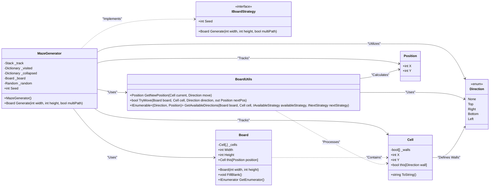

# Source Code for the Generation Folder Diagram

This is the source code for the generation folder diagram.  
The diagram was generated using [Mermaid](https://mermaid.live/edit).

To visualize the diagram, paste the following code into the Mermaid live editor or any Mermaid-compatible Markdown viewer.

