# Maze Generator and Solver

This project is a comprehensive application for generating and solving mazes. The mazes are created using the **Depth First Search (DFS)** algorithm, and multiple solving algorithms are available to explore and analyze. Users can customize maze dimensions, random seed, and configuration to suit various use cases or testing scenarios.

<div style="display: flex; justify-content: space-around;">
    
    
</div>

## Table of Contents

1. [Overview](#overview)
2. [Generation](#generation)
3. [Solving](#solving)
4. [Visualization](#visualization)
5. [Features](#features)
6. [How to Run](#how-to-run)
7. [Future Work](#future-work)
8. [License](#license)

---

## Overview

The **Maze Generator and Solver** application provides an interactive platform to:

- Generate mazes using the DFS algorithm.
- Solve generated mazes with various algorithms, including heuristic and manual approaches.
- Visualize the generation and solving processes in real-time for educational and debugging purposes.

Users can define maze characteristics such as size, random seed, and the inclusion of multiple paths, making the tool flexible for both casual and professional use.

---

## Generation


The maze generation process is implemented in the **`MazeGenerator`** class, which follows the **Strategy Pattern** via the **`IBoardStrategy`** interface. This allows for seamless extension to other generation algorithms in the future.

### Process Overview

1. **Initialization**:

   - A 2D array of `Cell` objects represents the maze grid.
   - Each `Cell` starts with all walls intact and possible moves in all directions (`Top`, `Right`, `Bottom`, `Left`).
   - The starting cell is positioned at the **top-left corner**, and the target cell defaults to the **bottom-right corner**.

   The **`BoardUtils`** class provides utility methods for initializing and resetting the board.

2. **Depth First Search Algorithm**:

   - Starting from a designated cell, a random unvisited neighbor is chosen, and the walls between the cells are removed to create a path.
   - When no unvisited neighbors remain, the algorithm backtracks to explore new paths until all cells are visited.

3. **Customizable Parameters**:
   - **Seed**: Reproduce specific maze layouts by setting a random seed.
   - **Size**: Define the width and height of the maze.
   - **MultiPath**: Toggle between single-path mazes and mazes with multiple solutions.

---

## Solving



The application provides multiple maze-solving algorithms, implemented as classes that conform to the **`IPathSolver`** interface. Each algorithm visualizes its unique approach to finding a solution.

### Available Algorithms

1. **A-Star (A\*)**:

   - Uses a heuristic function to prioritize the shortest paths.
   - Balances efficiency with accuracy, offering a clear visual representation of its decision-making process.

2. **Breadth-First Search (BFS)**:

   - Explores all paths level by level.
   - Guarantees the shortest path but lacks heuristic guidance, making it slower for large mazes.

3. **Hand-on-Wall (left- and right-handed)**:

   - Mimics the real-world approach of tracing walls to navigate the maze.
   - Effective for mazes with walls connected to the boundary but may not yield optimal paths.

4. **Custom Solvers**:
   - Developers can extend the application by implementing additional solvers via the **`IPathSolver`** interface.

---

## Visualization



Real-time visualization is a core feature, providing an intuitive understanding of the generation and solving algorithms.

### Key Features

- **Dynamic Updates**:  
  Each cell's state (visited, path, start, or target) is updated live.

- **Color-Coded Indicators**:

  - **Visited Cells**: Highlighted as they are processed.
  - **Solution Path**: Clearly marked upon completion.
  - **Start/Target Points**: Easily distinguishable on the grid.

- **Playback Speed**:  
  Control the speed of the solving animations for step-by-step analysis.

---

## Features

- **Customizable Maze Parameters**: Define dimensions, seed, and multipath settings.
- **Algorithm Variety**: Experiment with heuristic and non-heuristic solvers.
- **Interactive Controls**: Modify start and target points directly on the grid.
- **Educational Visualization**: See algorithms in action, step by step.

---

## How to Run

1. **Clone the Repository**:
   ```bash
   git clone https://github.com/your-repo/maze-simulation.git
   cd maze-simulation
   ```
2. Open the solution file in Visual Studio:

- Open MazeSimulation.sln.

3. Build and run the application:

- Press F5 to start the application in debug mode.

4. Interact with the UI:

- Customize maze size, generation seed, and algorithms.
- Visualize maze solving.

## Future Work

- **Dynamic Visualization**:  
  Refactor the project to allow the visualization of the solver to be dynamically adjusted during the solving process.

- **Advanced Solvers**:  
  Extend the solver library with more advanced techniques to handle larger and more complex mazes efficiently.

- **Export Functionality**:  
  Add the ability to export solved mazes as images or text files, enabling easy sharing and further analysis.

## License

This project is licensed under the [MIT License](./LICENSE). See the LICENSE file for details.
