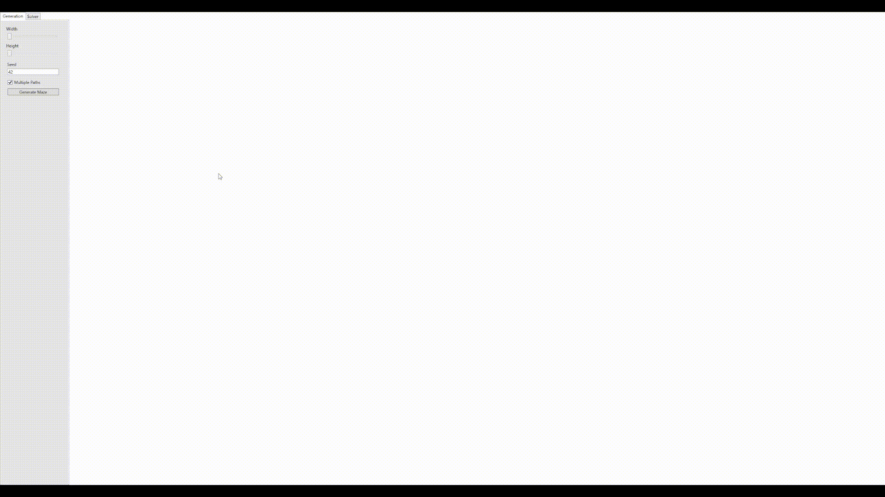
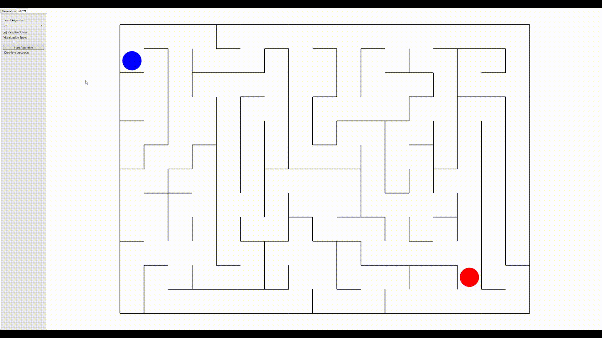

# Maze Generator and Solver

This project is an interactive application designed for generating and solving mazes. It utilizes the **Depth First Search (DFS)** algorithm for maze generation and supports multiple solving algorithms. The tool provides real-time visualization of the solving processes, making it suitable for educational purposes and testing.

| Maze Generation                                   | Maze Solving                                   |
|---------------------------------------------------|-----------------------------------------------|
|  |  |


## Table of Contents

1. [Overview](#overview)
2. [Shared Folder](#shared-folder)
3. [Generation](#generation)
4. [Solving](#solving)
5. [Visualization](#visualization)
6. [Features](#features)
7. [System Requirements](#system-requirements)
8. [How to Run](#how-to-run)
9. [Future Work](#future-work)
10. [License](#license)

## Overview

The **Maze Generator and Solver** application offers an interactive environment to:

- Generate mazes using the DFS algorithm.
- Solve generated mazes using multiple solving algorithms, including heuristic and manual approaches.
- Visualize the solving processes in real-time for educational and debugging purposes.

Users can customize various aspects of the maze, such as its dimensions, random seed, and path configuration, making this tool highly flexible.

# Shared Folder



The **`shared`** folder contains foundational classes, interfaces, and utility functions that are reused across various components of the application. This structure ensures the code remains modular, maintainable, and extendable. It includes:

- **`Board` Class**: Represents a 2D grid of cells, providing methods for accessing and manipulating cells, with support for iteration.
- **`Cell` Class**: Defines the basic building block of the board, including its position and wall states (top, right, bottom, left).
- **Utility Classes**:
  - `BoardUtils`: Includes methods for calculating new positions, navigating within board boundaries, and determining available movement directions.
  - `MathUtils`: Provides a method for mapping values between ranges.
- **Direction and Position Types**:
  - `Direction`: An enum representing movement directions.
  - `Position`: A struct for representing X and Y coordinates.
- **Strategy Interfaces**:
  - `IAvailableStrategy`: Defines how available movement directions are determined.
  - `INextStrategy`: Defines how the next direction is selected from a list of available directions.
- **Strategy Implementations**:
  - `WallStrategy` & `NoWallStrategy`: Determine directions based on the presence or absence of walls.
  - `FirstNextStrategy` & `RandomNextStrategy`: Select the next direction either deterministically or randomly.
- **`Solve` Record**: Encapsulates the result of a maze-solving algorithm, including movement sequences, processing steps, and cell values.

### Benefits of the `shared` Folder:

- **Modularity**: Logical separation of concerns enables independent modifications or extensions to individual components.
- **Reusability**: The defined classes and methods can be utilized in different parts of the maze simulation system.
- **Extensibility**: New strategies or board manipulation methods can be implemented by extending existing interfaces or classes.

## Generation



The maze generation process is managed by the **`MazeGenerator`** class, which leverages the **Strategy Pattern** through the **`IBoardStrategy`** interface. This design makes it easy to extend the application with new maze generation algorithms.

### Process Overview

1. **Initialization**:

   - A 2D array of `Cell` objects represents the maze grid.
   - Initially, each `Cell` has all its walls intact, with all directions (`Top`, `Right`, `Bottom`, `Left`) marked as potential moves.
   - The maze starts at the **top-left corner**, and the target cell is set at the **bottom-right corner**.
   - Utility functions from the **`BoardUtils`** class are used to initialize and reset the board.

2. **Depth First Search (DFS) Algorithm**:

   - The algorithm begins at a specified cell and selects a random unvisited neighbor.
   - Walls between the current cell and the neighbor are removed, creating a path.
   - If no unvisited neighbors are available, the algorithm backtracks, ensuring all cells are visited.

3. **Customizable Parameters**:
   - **Seed**: Specify a random seed to reproduce specific maze layouts.
   - **Size**: Set the maze's width and height.
   - **MultiPath**: Decide between generating single-path mazes or mazes with multiple solutions.

### Key Features

- **Extensibility**: The implementation uses a strategy-based design to allow new maze generation methods to be added without modifying existing code.
- **Flexibility**: The generator supports the creation of mazes with either a single path or multiple solutions by toggling the `MultiPath` parameter.
- **Randomization**: The ability to set a seed ensures that specific maze layouts can be reproduced when needed.
- **Custom Connections**: Additional paths can be introduced by randomly removing walls between cells after the main maze is generated.

## Solving



The maze-solving process is designed to demonstrate various algorithms, each implemented via the **`IPathSolver`** interface. This modular approach enables flexibility and the addition of new algorithms with ease.

### Supported Algorithms

1. **A-Star (A\*)**:

   - Uses a heuristic to estimate the remaining distance to the target.
   - Balances actual distance traveled with estimated cost, providing an efficient solution.
   - The algorithm is highly effective for finding the shortest path and includes visual feedback during execution.

2. **Breadth-First Search (BFS)**:

   - Explores the maze level by level, ensuring the shortest path is found.
   - As it does not use heuristics, BFS may be slower for larger mazes.
   - Provides clear step-by-step visualization of the solving process.

3. **Hand-on-Wall (Left-Handed and Right-Handed)**:

   - Simulates real-world wall-following techniques, navigating by keeping either the left or right hand on the wall.
   - While simple and intuitive, this approach may not always find the optimal or fastest path.
   - Ideal for demonstrating basic solving methods in mazes with loops or multiple paths.

4. **Custom Solvers**:
   - Developers can create and integrate their own solving algorithms by implementing the **`IPathSolver`** interface.
   - This extensibility allows for experimentation and adaptation to different types of mazes or solving requirements.

### Key Features

- **Visualization**: Each algorithm displays its progress in real-time, highlighting visited cells, the processing order, and the resulting path.
- **Flexibility**: The modular design allows for easy substitution and comparison of algorithms.
- **Customization**: Parameters like start position, end position, and solver type can be tailored to the user’s needs.

## Visualization



Real-time visualization is one of the standout features of this project, offering an intuitive way to observe the inner workings of maze solving algorithms.

### Key Features

- **Dynamic Cell Updates**:  
  Each cell’s state (e.g., visited, part of the solution path, start, or target) is visually updated in real-time during algorithm execution.

- **Color-Coded Indicators**:  
  Easily differentiate cell states with intuitive colors:

  - **Visited Cells**: Highlighted as they are processed by the algorithm.
  - **Solution Path**: Clearly marked after solving, ensuring easy readability.
  - **Start/Target Points**: Distinctively styled for quick identification.

- **Interactive Playback Controls**

  - **Adjust Playback Speed**:  
    Use the playback slider to slow down or speed up the visualization, allowing a detailed view of each step or a faster solution.

  - **Mouse Interaction**:
    - **Set Target**: Right-click on a cell to designate it as the **target position**.
    - **Set Start**: Left-click on a cell to designate it as the **start position**.

These interactive controls provide flexibility in customizing the solving process and make it easier to test various scenarios dynamically.

### Educational Benefits

This feature not only makes the algorithms visually engaging but also provides educational insights into how maze solving processes operate. By observing the step-by-step evolution, users can develop a deeper understanding of the underlying logic and principles.

## System Requirements

To run this project, ensure you have the following installed:

- **Operating System**: Windows 10 or later / macOS 11 or later
- **.NET Version**: .NET 6.0 or later
- **IDE**: Visual Studio 2022 (recommended) or any compatible .NET IDE
- **Optional**: Git for cloning the repository

## How to Run

1. **Clone the Repository**:

   ```bash
   git clone https://github.com/your-repo/maze-simulation.git
   cd maze-simulation
   ```

2. Open the solution file in Visual Studio:

- Open MazeSimulation.sln.

3. Build and run the application:

- Press F5 to start the application in debug mode.

4. Interact with the UI:

- Customize maze size, generation seed, and algorithms.
- Visualize maze solving.

## Future Work

- **Advanced Solvers**:  
  Extend the solver library with more advanced techniques to handle larger and more complex mazes efficiently. Examples include bidirectional search or algorithms optimized for 3D maze structures.

- **Export Functionality**:  
  Add the ability to export solved mazes as images or text files, enabling easy sharing, further analysis, or integration into other applications.

- **Performance Optimization**:  
  Improve the maze generation algorithm to handle larger grids more efficiently. This may involve:

  - Implementing multi-threading for parallel processing.
  - Refining the Depth First Search (DFS) implementation to reduce overhead.
  - Exploring alternative generation algorithms for better scalability.

- **Enhanced Visualization**:  
  Introduce additional visualization features, such as:

  - Heatmaps to indicate processing intensity or pathfinding efficiency.

- **Algorithm Benchmarks**:  
  Develop a benchmarking tool to measure and compare the performance of different solving algorithms in terms of speed, memory usage, and path quality.

- **Multi-Dimensional Mazes**:  
  Expand support to generate and solve 3D or even higher-dimensional mazes, offering new challenges and visualization opportunities.

## License

This project is licensed under the [MIT License](./LICENSE). See the LICENSE file for details.
