# Maze Generator and Solver

This project provides an application for generating and solving mazes. The mazes are created using the Depth First Search (DFS) algorithm, and various solving algorithms are implemented. Users can customize the maze size and the random seed for maze generation, allowing for the creation and testing of different maze configurations.

## Table of Contents

<h3 style="color:red">TODO!!!</h3>

## Generation

The maze generation process is handled by the **`MazeGenerator`** class, which implements the **`IBoardStrategy`** interface. This allows the application to follow the Strategy Pattern, making it flexible for integrating different maze generation or other bordgame algorithms in the future.

### How It Works

1. **Initialization**:  
   The board is represented as a 2D array of `Cell` objects. Each `Cell` is initialized with all walls intact and possible moves in all directions (`Top`, `Right`, `Bottom`, `Left`).

   - The starting cell is set at the top-left corner.
   - The target cell is positioned at the bottom-right corner by default.

   Initialization is supported by static utility methods in the **`BoardUtils`** class, which provides reusable logic to set up and reset the board.

2. **Depth First Search Algorithm**:  
   The maze is generated using the DFS algorithm:

   - Starting from a specified cell, the algorithm selects a random direction (from available moves) and removes walls between adjacent cells to create a path.
   - It backtracks when no further moves are possible, ensuring every cell in the maze is visited.

3. **Customizable Parameters**:
   - **Seed**: The random seed allows users to recreate specific maze layouts.
   - **Size**: Users can define the width and height of the maze.
   - **multiPath**: Users can define if there are more than one path.

### Key Components

- [**`Cell`**](/Maze-Simulation/Generation/Cell.cs): Represents a single unit of the board with walls, coordinates, and state information (e.g., visited, collapsed, start, or target).
- [**`IBoardStrategy`**](/Maze-Simulation/Generation/IBoardStrategy.cs): Defines the contract for generation strategies, allowing for different algorithms to be implemented and swapped dynamically. It includes methods for resetting the board, setting the starting point, and for example generating the maze.

- [**`MazeGenerator`**](/Maze-Simulation/Generation/MazeGenerator.cs): Implements the DFS algorithm, managing the cells and tracking visited paths using a stack.
- [**`BoardControl`**](/Maze-Simulation/Generation/BoardControl.cs): Manages the overall board dimensions, initialization, and strategy configuration.
- [**`BoardUtils`**](/Maze-Simulation/Generation/BordUtils.cs): Contains static methods for initializing and resetting the board.

## Solving

## Visualization
